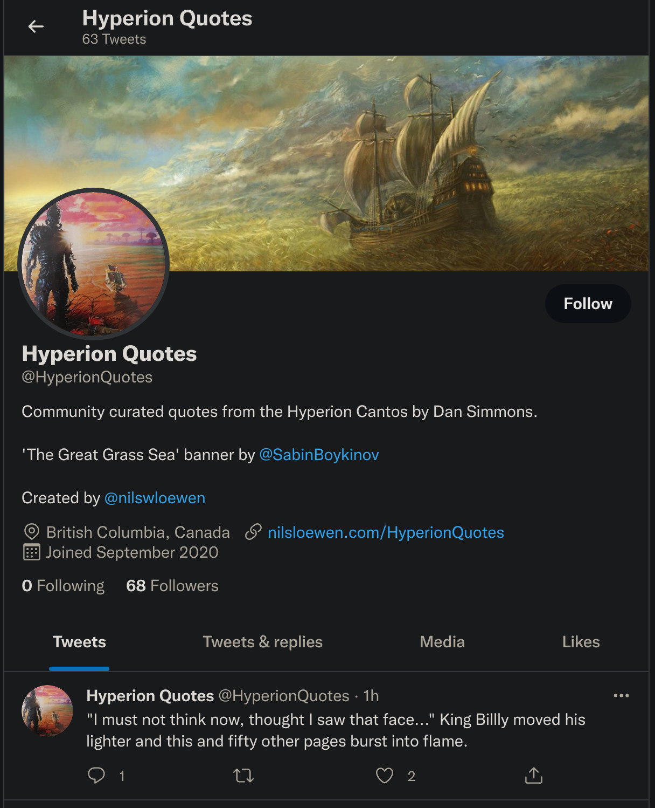

# HyperionQuotes Twitter Bot

A Drupal powered backend for a community driven Twitter Bot. 

Realized at [twitter.com/HyperionQuotes](https://twitter.com/HyperionQuotes)

## Basic Overview

  1. Fans of Hyperion by Dan Simmons can submit their favourite quotes from the book to [nilsloewen.com/HyperionQuotes](nilsloewen.com/HyperionQuotes). 
  2. The submission is added to a queue that can be manually reviewed and managed through Drupal. 
  3. Once a day the Twitter bot picks a random submission and posts it from the @HyperionQuotes account.
  4. The first comment on each post gives a shoutout to the Twitter user who submitted the quote. 
  5. Followers of the @HyperionQuotes account get pulled back into this wondrous universe for just a brief moment of bliss on their timeline. 

